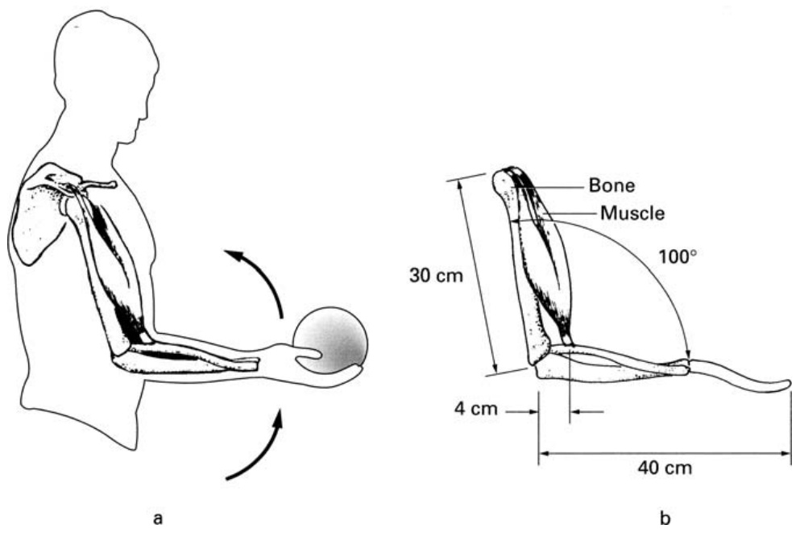

  
FIGURE 1.6  Compensating for a side-pushing force.  

# Skeletal Muscles  

The skeletal muscles producing skeletal movements consist of many thou- sands of parallel fibers wrapped in a flexible sheath that narrows at both ends into tendons (Fig. 1.8). The tendons, which are made of strong tissue, grow into the bone and attach the muscle to the bone. Most muscles taper to a sin- gle tendon. But some muscles end in two or three tendons; these muscles are called, respectively,  biceps  and  triceps . Each end of the muscle is attached to a di ff erent bone. In general, the two bones attached by muscles are free to move with respect to each other at the joints where they contact each other.  

This arrangement of muscle and bone was noted by Leonardo da Vinci, who wrote, “The muscles always begin and end in the bones that touch one another, and they never begin and end on the same bone. . . .” He also stated,  
  
FIGURE 1.7  Increased stability resulting from spreading the legs.  

“It is the function of the muscles to pull and not to push except in the cases of the genital member and the tongue.”  

Da Vinci’s observation about the pulling by muscles is correct. When fibers in the muscle receive an electrical stimulus from the nerve endings that are attached to them, they contract. This results in a shortening of the muscle and a corresponding pulling force on the two bones to which the muscle is attached.  

There is a great variability in the pulling force that a given muscle can apply. The force of contraction at any time is determined by the number of individual fibers that are contracting within the muscle. When an individual fiber receives an electrical stimulus, it tends to contract to its full ability. If a stronger pulling force is required, a larger number of fibers are stimulated to contract.  

Experiments have shown that the maximum force a muscle is capable of exerting is proportional to its cross section. From measurements, it has been bout  $7\times10^{6}\,\mathrm{dyn}/\mathrm{cm}^{2}$    of its area  $(7\times10^{6}\,\mathrm{dyn/cm^{2}}=7\times10^{5}\,\mathrm{Pa}=102\,\mathrm{lb/in^{2}})$   ×   "  ×  " ).  
  

  
FIGURE 1.8  Drawing of a muscle.  

To compute the forces exerted by muscles, the various joints in the body can be conveniently analyzed in terms of levers. Such a representation implies some simplifying assumptions. We will assume that the tendons are connected to the bones at well-defined points and that the joints are frictionless.  

Simplifications are often necessary to calculate the behavior of systems in the real world. Seldom are all the properties of the system known, and even when they are known, consideration of all the details is usually not necessary. Calculations are most often based on a model, which is assumed to be a good representation of the real situation.  

# 1.5 Levers  

A lever is a rigid bar free to rotate about a fixed point called the  fulcrum . The position of the fulcrum is fixed so that it is not free to move with respect to the bar. Levers are used to lift loads in an advantageous way and to transfer movement from one point to another.  
There are three classes of levers, as shown in Fig. 1.9. In a Class 1 lever, the fulcrum is located between the applied force and the load. A crowbar is an example of a Class 1 lever. In a Class 2 lever, the fulcrum is at one end of the bar; the force is applied to the other end; and the load is situated in between. A wheelbarrow is an example of a Class 2 lever. A Class 3 lever has the fulcrum at one end and the load at the other. The force is applied between the two ends. As we will see, many of the limb movements of animals are performed by Class 3 levers.  

It can be shown from the conditions for equilibrium (see Appendix A) that, for all three types of levers, the force  $F$   required to balance a load of weight  $W$   is given by  

$$
F=\frac{W d_{1}}{d_{2}},
$$  

where  $d_{1}$   and    $d_{2}$   are the lengths of the lever arms, as shown in Fig. 1.9 (see Exercise 1-2). If    $d_{1}$   is less than    $d_{2}$  , the force required to balance a load is smaller than the load. The mechanical advantage    $M$   of the lever is defined as  

$$
M={\frac{W}{F}}={\frac{d_{2}}{d_{1}}}.
$$  

Depending on the distances from the fulcrum, the mechanical advantage of a Class 1 lever can be greater or smaller than one. By placing the load close to the fulcrum, with  $d_{1}$   much smaller than  $d_{2}$  , a very large mechanical advantage can be obtained with a Class 1 lever. In a Class 2 lever,  $d_{1}$   is always smaller than  $d_{2}$  ; therefore, the mechanical advantage of a Class 2 lever is greater than one. The situation is opposite in a Class 3 lever. Here  $d_{1}$   is larger than  $d_{2}$  ; therefore, the mechanical advantage is always less than one.  

  
FIGURE 1.9  The three classes of lever.  
  
FIGURE 1.10  Motion of the lever arms in a Class 1 lever.  

A force slightly greater than what is required to balance the load will lift it. As the point at which the force is applied moves through a distance  $L_{2}$  , the load moves a distance    $L_{1}$   (see Fig. 1.10). The relationship between    $L_{1}$   and  $L_{2}$  , (see Exercise 1-2) is given by  

$$
{\frac{L_{1}}{L_{2}}}={\frac{d_{1}}{d_{2}}}.
$$  

The ratio of velocities of these two points on a moving lever is likewise given by  

$$
\frac{v_{1}}{v_{2}}=\frac{d_{1}}{d_{2}}.
$$  

Here    $v_{2}$   is the velocity of the point where the force is applied, and  $v_{1}$   is the velocity of the load. These relationships apply to all three classes of levers. Thus, it is evident that the excursion and velocity of the load are inversely proportional to the mechanical advantage.  

# 1.6 The Elbow  

The two most important muscles producing elbow movement are the biceps and the triceps (Fig. 1.11). The contraction of the triceps causes an extension, or opening, of the elbow, while contraction of the biceps closes the elbow. In our analysis of the elbow, we will consider the action of only these two muscles. This is a simplification, as many other muscles also play a role in elbow movement. Some of them stabilize the joints at the shoulder as the elbow moves, and others stabilize the elbow itself.  
  

FIGURE 1.11  The elbow.  

  
FIGURE 1.12 (a) Weight held in hand. (b) A simplified drawing of (a).  
  
FIGURE 1.13  Lever representation of Fig. 1.12.  

Figure 1.12a shows a weight  W  held in the hand with the elbow bent at a  $100^{\circ}$  angle. A simplified diagram of this arm position is shown in Fig. 1.12b. The dimensions shown in Fig. 1.12 are reasonable for a human arm, but they will, of course, vary from person to person. The weight pulls the arm down- ward. Therefore, the muscle force acting on the lower arm must be in the up direction. Accordingly, the prime active muscle is the biceps. The position of the upper arm is fixed at the shoulder by the action of the shoulder muscles. We will calculate, under the conditions of equilibrium, the pulling force    $F_{m}$  exerted by the biceps muscle and the direction and magnitude of the reaction force  $F_{r}$   at the fulcrum (the joint). The calculations will be performed by con- sidering the arm position as a Class 3 lever, as shown in Fig. 1.13. The  $x$  - and  $y$  -axes are as shown in Fig. 1.13. The direction of the reaction force  $F_{r}$   shown is a guess. The exact answer will be provided by the calculations.  

In this problem we have three unknown quantities: the muscle force    $F_{m}$  , the reaction force at the fulcrum    $F_{r}$  , and the angle, or direction, of this force  $\phi$  . The angle  $\theta$   of the muscle force can be calculated from trigonometric con- siderations, without recourse to the conditions of equilibrium. As is shown in Exercise 1-3, the angle  $\theta$   is   $72.6^{\circ}$  .  

For equilibrium, the sum of the    $x$   and    $y$   components of the forces must each be zero. From these conditions we obtain  

$$
\begin{array}{r l}{x\mathrm{~components~of~the~forces}\!:\,}&{{}F_{m}\cos\theta\,=F_{r}\cos\phi}\\ {y\mathrm{~components~of~the~forces}\!:\,}&{{}F_{m}\sin\theta\,=W\!+F_{r}\sin\phi}\end{array}
$$  

These two equations alone are not su ffi cient to determine the three unknown quantities. The additional necessary equation is obtained from the torque con- ditions for equilibrium. In equilibrium, the torque about any point in Fig. 1.13 must be zero. For convenience, we will choose the fulcrum as the point for our torque balance.  
The torque about the fulcrum must be zero. There are two torques about this point: a clockwise torque due to the weight and a counterclockwise torque due to the vertical  $y$   component of the muscle force. Since the reaction force  $F_{r}$   acts at the fulcrum, it does not produce a torque about this point.  

Using the dimensions shown in Fig. 1.12, we obtain  

$$
4\,\mathrm{cm}\times F_{m}\sin\theta=40\,\mathrm{cm}\times W
$$  

or  

$$
F_{m}\sin\theta=10\,W
$$  

Therefore, with  $\theta=72.6^{\circ}$  , the muscle force    $F_{m}$   is  

$$
F_{m}=\frac{10\,W}{0.954}=10.5\,W
$$  

With a  $14\mathrm{-kg}$   (31-lb) weight in hand, the force exerted by the muscle is  

$$
F_{m}=10.5\times14\times9.8=1440\,\mathrm{N}\;(325\,\mathrm{lb})
$$  

If we assume that the diameter of the biceps is  $8\,\mathrm{cm}$   and that the muscle can produce a  $7\times10^{6}$    dyn force for each square centimeter of area, the arm is capable of supporting a maximum of 334 N (75 lb) in the position shown in Fig. 1.13 (see Exercise 1-4).  

The solutions of Eqs. 1.10 and 1.11 provide the magnitude and direction of the reaction force    $F_{r}$  . Assuming as before that the weight supported is  $14\,\mathrm{kg}$  , these equations become  

$$
\begin{array}{l}{1440\;\times\;\cos72.6\;=F_{r}\cos\phi}\\ {1440\;\times\;\sin72.6\;=14\times9.8+F_{r}\sin\phi}\end{array}
$$  

or  

$$
\begin{array}{l}{{F_{r}\cos\phi\,=430\,\mathrm{N}}}\\ {{F_{r}\sin\phi\,=1240\,\mathrm{N}}}\end{array}
$$  

Squaring both equations, using   $\cos^{2}\phi+\sin^{2}\phi=1$   and adding them, we obtain  

$$
F_{r}^{2}=1.74\times10^{6}\,{\mathrm{N}}^{2}
$$  

or  

$$
F_{r}=1320\,\mathrm{N}\,(298\,\mathrm{lb})
$$  

From Eqs. 1.14 and 1.15, the cotangent of the angle is  

$$
\cot\phi=\frac{430}{1240}=0.347
$$  

and  

$$
\phi=70.9^{\circ}
$$  
Exercises 1-5, 1-6, and 1-7 present other similar aspects of biceps mechanics. In these calculations we have omitted the weight of the arm itself, but this e ff ect is considered in Exercise 1-8. The forces produced by the triceps muscle are examined in Exercise 1-9.  

Our calculations show that the forces exerted on the joint and by the muscle are large. In fact, the force exerted by the muscle is much greater than the weight it holds up. This is the case with all the skeletal muscles in the body. They all apply forces by means of levers that have a mechanical advantage less than one. As mentioned earlier, this arrangement provides for greater speed of the limbs. A small change in the length of the muscle produces a relatively larger displacement of the limb extremities (see Exercise 1-10). It seems that nature prefers speed to strength. In fact, the speeds attainable at limb extremities are remarkable. A skilled pitcher can hurl a baseball at a speed in excess of   $100\,\mathrm{mph}$  . Of course, this is also the speed of his hand at the point where he releases the ball.  

# 1.7 The Hip  

Figure 1.14 shows the hip joint and its simplified lever representation, giving dimensions that are typical for a male body. The hip is stabilized in its socket by a group of muscles, which is represented in Fig. 1.14b as a single resultant force    $F_{m}$  . When a person stands erect, the angle of this force is about  $71^{\circ}$  with respect to the horizon.    $W_{L}$   represents the combined weight of the leg, foot, and thigh. Typically, this weight is a fraction (0.185) of the total body weight    $W$   (i.e.,    $W_{L}=0.185\:W$  ). The weight  $W_{L}$   is assumed to act vertically downward at the midpoint of the limb.  

We will now calculate the magnitude of the muscle force  $F_{m}$   and the force  $F_{R}$   at the hip joint when the person is standing erect on one foot as in a slow walk, as shown in Fig. 1.14. The force  W  acting on the bottom of the lever is the reaction force of the ground on the foot of the person. This is the force that supports the weight of the body.  

From equilibrium conditions, using the procedure outlined in Section 1.6, we obtain  

$$
F_{m}\cos71^{\circ}-F_{R}\cos\theta=0
$$  

$$
\mathrm{force}=0)
$$  

$$
F_{m}\sin71^{\circ}+W-W_{L}-F_{R}\sin\theta=0
$$  

$$
\mathrm{force}=0)
$$  

$$
\begin{array}{c}{\left(F_{R}\sin\theta\right)\times7\,\mathrm{cm}+W_{L}\times10\,\mathrm{cm}}\\ {-W\times18\,\mathrm{cm}=0}\end{array}
$$  
  

FIGURE 1.14 (a) The hip. (b) Its lever representation.  

Since    $W_{L}=0.185\:W$  , from Eq. 1.20 we have  

$$
F_{R}\sin\theta=2.31\,W
$$  

Using the result in Eq. 1.19, we obtain  

$$
F_{m}={\frac{1.50\,W}{\sin71^{\circ}}}=1.59\,W
$$  
