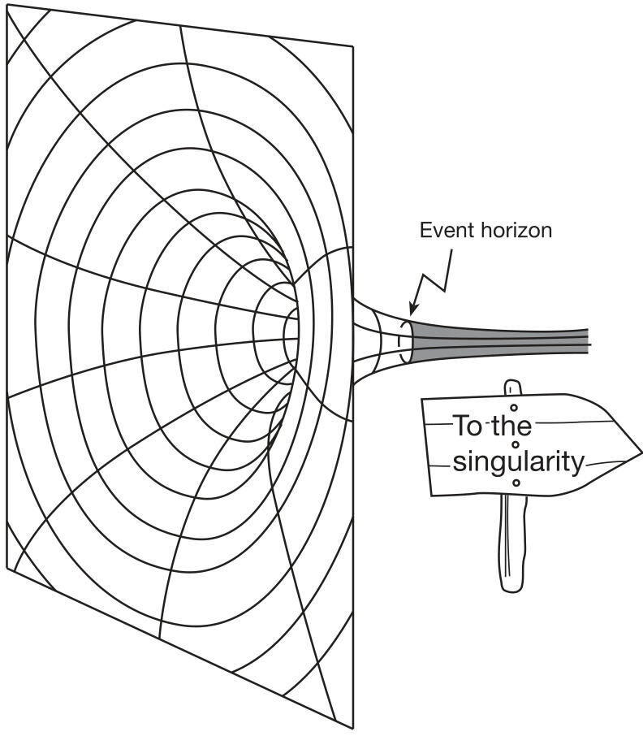

obtain its density we must divide a number that is non-zero by zero. And this, believe me, is a highly undesirable thing to do in mathematics. Try it for yourself. Divide any number by zero on a pocket calculator. Mine gives me the symbol ‘-E-’ which stands for ‘error’ since a humble calculator cannot cope with infinity. Come to think of it neither can my powerful workstation computer I use for research at university. If it encounters a division by zero the program it is running simply crashes. At least it does me the courtesy of telling me where the problem is in the code. It turns out, however, that the singularity is not quite as nasty as this. When we apply the rules of quantum mechanics, as we must do at this level, we discover that the singularity has an extremely tiny (much smaller than an atom) but  non-zero  size. Many of the details of the physics have yet to be ironed out, since applying the rules of quantum mechanics at the same time as the rules of general relativity is something no one knows how to do properly yet.  

A black hole is therefore very simple in its structure. It has a centre (the singularity) and a surface (the event horizon). All else is gravity. Of course what makes black holes so fascinating is the way their tremendous gravity affects space (and time 5 ) nearby.  

# A hole that can never be filled  

So far, I have described the formation of a black hole in terms of gravitational collapse. But we have learnt that Einstein’s view of gravity is in terms of the curvature of space. A black hole can also be described in this way. Think of the example I used in Chapter 2  

5  Aficionados of relativity theory and black holes may be wondering by now why I have steered clear of the discussion of time and how it is affected by gravity according to Einstein. I am aware that the traditional way of teaching black hole physics is within a unified description of the curvature of space and time. Indeed it will be very difficult for me to describe what happens if we were to fall into a black hole without discussing how our perception of time is changed. However the whole concept of time has been so revolutionized by Einstein’s work that it deserves a more careful and gentle introduction for non-physicists. I will therefore, as much as possible, postpone any discussions about the nature of time, inside and outside black holes, till later in the book.  
  
Figure 4.1.  A black hole in 2D space.  

of placing a heavy object in the middle of a rubber sheet causing it to sag under the weight. This dip in the sheet is equivalent to the curvature of space under the influence of a massive body. If the body is much heavier, the dip would be deeper. A black hole corresponds to the case when a very heavy, yet point-sized, object causes the rubber (space) to be curved and stretched down into an infinitely deep cone-shaped hole (figure 4.1). The event horizon here corresponds to a circle somewhere inside the rim of this bottomless pit beyond which there would be no escape.  
There are two interesting observations we can make here based on this simple picture. Firstly, a black hole can never be plugged up or filled in with matter. The more matter that is poured into a black hole the bigger it gets. It will feed and grow.  

Secondly, the size of a black hole, as measured by the volume within its event horizon, is really only a measure as seen by an outside observer. As an example, a black hole formed by the collapse of a star ten times the mass of the Sun will have a Schwarzschild radius of thirty kilometres, making the black hole roughly the size of a large city. Of course, an outside observer cannot see beyond the event horizon anyway and therefore can have no idea what things are like inside. But if space inside the horizon forms an infinitely deep hole then the distance from the horizon to the singularity should really also be infinite. In reality, and as I shall describe later, if you were to fall into a black hole then it would take you only a very short time to reach the singularity since space and time go haywire inside the horizon and one cannot use simple rules such as speed equalling distance divided by time.  

From the outside, all black holes of the same mass look identical; we are unable to learn anything about the object that created the black hole in the first place, even being ignorant of its original chemical composition. All that information has been lost from our Universe forever. William J Kaufmann makes this point clearly in his excellent book,  Universe . He considers two hypothetical black holes—one produced by the gravitational collapse of ten solar masses of iron and another from ten solar masses of peanut butter. Once they have both collapsed beyond their event horizons, they become identical and we are unable to tell which black hole was formed from which substance.  

A common misconception regarding black holes is that they will eventually gobble up everything in the Universe. This is not true. Gravity is said to behave relativistic ally in a region where the predictions of Einstein’s version depart radically from those of Newtonian gravity. For example, a black hole with a Schwarzschild radius of thirty kilometres will only cause the gravitational field around it to behave relativistic ally out to a distance of a thousand kilometres. Outside this range, the black hole obeys the rather boring laws of Newtonian gravity and behaves like any normal star of that mass in the way it affects the motion of distant objects.  
# Spinning black holes  

So far I have restricted myself to discussing the simplest kind of black hole: one that is described by the Schwarzschild solution of Einstein’s field equations. This is really only an idealized scenario. A real black hole would be spinning too. We know that stars spin about their axis in the same way that the Earth does. Therefore when they collapse they will spin even faster. Let us examine briefly why this should be so.  

An important quantity in physics is known as angular momentum and is possessed by all rotating objects. The reason it is so important is that it is one of those quantities, like energy, that is said to be  conserved , which means it stays the same provided the rotating object is not subjected to an external force. Angular momentum depends on the mass of the object, the rate it is spinning and its shape. Think of an ice skater spinning with her arms extended outwards. As she brings her arms closer to her body and folds them against her chest, she will spin faster. The reason for this is that her angular momentum must remain constant— ignoring friction of the blades on the ice—and, by bringing her arms in, she has altered her shape which would reduce her angular momentum if this were all that happens. However, she will also spin faster to compensate for this and keep her angular momentum the same. This increase in the rate at which she spins is not something that she does deliberately; it happens automatically. Aren’t the laws of physics clever? A collapsing spinning star behaves in the same way: its reduced size must be countered by it spinning faster in order to maintain its angular momentum. This is why pulsars (the spinning neutron stars we met in Chapter 2) spin so rapidly.  

According to Newton’s version of gravity we cannot tell the difference between the gravitational effects of a spinning spherical object and one that is not spinning (as long as it does not wobble about as it spins). Here again, general relativity is different. A spinning black hole literally drags space around it to form a gravi- tational vortex, rather like the way water circles round a plughole. In such a region of space an orbiting body would have to accelerate in the opposite direction to the spin of the black hole just to stand still! This strange result provides us with a means of measuring the rate at which a black hole is spinning which, along with its mass (from which we can deduce its size), is the only other quan- tity there is to describe all we can about a black hole 6 . To measure the spin of a black hole we need to put two satellites into orbit in opposite directions around it. Since the satellite that is orbiting in the opposite direction to the black hole’s spin must move ‘against the tide’ of moving space, it will take longer to complete one full orbit since by covering more space it has travelled further. The dif- ference in orbit times between the satellites tells us the rate of spin.  
This region where space is dragged round a spinning black hole is called the ergosphere. It means that a spinning black hole will have two horizons: an inner, spherical, one which is the original event horizon and from which nothing can escape and an outer, bulged-out at the equator one which marks the surface of the ergosphere (figure 4.2). Within the ergosphere, the dragging is so strong that nothing can stand still. However, an object that falls into the ergosphere can still escape again, as long as it does not stray within the event horizon.  

# Falling into a black hole  

One of the most fascinating things about black holes is what happens to objects/suicidal astronauts that fall into them, and how this compares with the way things look to an observer watching from a safe distance. Let us first consider what it would be like if you were unlucky enough to fall in to one.  

6  We can also measure the electric charge of a black hole but this would be very small and is only of interest theoretically. In practice, a charged black hole will always eventually be neutralized by sucking in particles which have the opposite electric charge to it.  
  
Figure 4.2.  The ergosphere surrounding the event horizon of a spinning black hole.  

One aspect of gravity that has not been mentioned so far is the tidal force. We know that the gravitational pull of a body becomes weaker the further away we are from it. Surely it then follows that, just by standing on the ground, your feet should feel a stronger pull due to the Earth’s gravity than your head, which is further away from the surface. This is in fact true, but the difference in the gravitational field of the Earth is so tiny over such a small distance that you would never feel it. We can, on the other hand, clearly see the tidal effects of the Moon’s gravity on the Earth. This is because the side of the Earth facing the moon feels a stronger gravitational pull than the opposite side which gives rise, as the Earth spins, to the daily tides of the seas from which the tidal force derives its name.  

When it comes to black holes the gravitational force is changing much more dramatically and you are able to feel the tidal effect even along the length of your body. This becomes unbearably strong and will ultimately rip you to shreds long before you are finally crushed at the singularity.  

A small black hole, of the order of several solar masses, has tidal forces so extreme that any astronaut venturing too close would be killed long before he or she has even crossed the event horizon! Not very nice is it? You would think that you might at least be given the chance to get close to the horizon without too much trouble. Luckily we have good reason to believe that there exist black holes with masses millions of times that of the Sun. Such supermassive black holes have much gentler tidal forces and one could easily cross the event horizon of such a hole without feeling any discomfort. As you continue to free fall towards the singularity the tidal forces will gradually grow in intensity. Thus although you will eventually be ripped apart then crushed to a point of infinite density at least you can now do a little sightseeing on your way down.  
Throughout this book you might have gathered 7   that I have been trying to postpone the discussion of gravity’s weird effect on time until the next section. I cannot, however, do black holes justice without relaxing my resolve on this a little. Inside a black hole space and time are so warped that the distance from the event horizon to the singularity is not a distance in space in the normal sense (in the sense that it can be measured in kilometres or some other appropriate unit of length). Instead it becomes a time direction. Basically the radial distance to the centre of the hole is interchanged with the time axis! Just a minute, you think, we have been discussing the size of black holes in terms of their Schwarzschild radius which is most definitely measured in units of length. The difference is that the Schwarzschild radius is a radius  as viewed from outside the hole . Imagine observing a black hole against a bright backdrop that would clearly highlight its dark horizon, such as a luminous gas nebula. The distance across this black disc is its diameter, or twice its Schwarzschild radius. Once inside the black hole things are very different.  

This interchange of space and time explains why any object falling into a black hole has no choice but to move inwards towards the singularity. Physicists liken this to the unavoidable way we move in time towards the future. What is more, since you can get no further once you have reached the singularity, this point must mark the end of time itself! This is where black hole singularities differ from the Big Bang which is a singularity that marks the beginning  of time. They are more like the Big Crunch singularity (the one that marks the end of space and time if there were enough matter in the Universe to cause it to collapse in on itself).  
The time it takes to reach the singularity from the horizon, as measured by someone falling in, is proportional to the mass of the black hole. Thus for a hole with ten times the mass of the Sun it would take just one ten-thousandth of a second to hit the singularity, whereas for a supermassive black hole it could take several minutes.  

A question that is often asked is whether an astronaut falling through the event horizon of a black hole notices anything different (assuming it is a big enough hole for the astronaut to survive the tidal forces). The answer is no. The only way you could find out whether you had crossed the horizon (notice how that astronaut has now become you? don’t take it personally, I don’t even know you and would not wish such an end on anyone) would be if you tried to halt your fall and climb back out again by firing your rocket engines to push yourself back up away from the centre of the hole. According to the Russian astrophysicist and leading black hole expert, Igor Novikov, just another of the weird aspects of black hole physics and a consequence of the way time is warped is that by trying to do this (firing your rockets to escape from the hole) you will reach the singularity even quicker than if you had left your engines off!  

This is certainly very counter-intuitive but he explains it in the following way. Remember that without the rocket engines firing you are in free fall and not feeling any gravitational force (apart from the tidal forces of course). By pointing your rocket away from the singularity and firing the engines you will feel a force of acceleration upwards and, due to the principle of equivalence, this is like feeling the effects of a gravitational field. However, because of the way space and time are mixed up inside a black hole you continue to fall  at the same rate  as before. It is just that now your time will slow down. This is known as gravitational time dilation and I will discuss it in Chapter 6. It means that a fall from the horizon to the singularity that would have taken you, say, ten seconds, might now seem like just five seconds. Weird!  

While writing this chapter, I mentioned to my wife, Julie, that I had reached the part where I describe what it is like inside a black hole. “Very dark, I expect” was her deadpan and profound reply. In fact it is not completely dark since the light from the outside Universe still gets in. The difference is that the light becomes bent and focused into a small bright patch. It would be like a view of the receding light from the entrance to a dark tunnel as you venture deeper inside the hole.  
Let us now consider what a distant observer sees when an object falls into a black hole that, for simplicity, is assumed not to be spinning. Imagine now that you are in your space ship, hovering at a safe distance outside the event horizon. You witness a colleague falling in towards the horizon. Rather than seeing him falling faster and faster until he suddenly disappears through the horizon, the rate of his fall seems to slow down more and more as he approaches the horizon until he finally stops, frozen, just outside it. This apparent slowing down of a falling object is due to the way gravity affects the rate of flow of time. In fact time literally slows down  in gravitational fields and this is most noticeable in the strong field outside a black hole.  

If the astronaut has calculated that he will pass through the event horizon at twelve o’clock precisely according to both of your previously synchronized watches, then you can, via a powerful telescope, observe the time shown on his watch as he falls. You will see the hands on his watch slow down as he approaches the horizon until they finally stop at twelve o’clock exactly. In fact, at the horizon time stands still. Sometimes it is (wrongly) suggested that you would see him frozen outside the horizon forever. In fact, his image will very quickly fade away and he will disappear. This is not because you have ‘seen’ him fall through the horizon, but rather because the light reaching you from him has been redshifted to such long wavelengths that it quickly goes beyond the visible spectrum. Thisredshiftisnotquitethesameasthatduetoreceding distant galaxies whose light is Doppler shifted. Now there is an additional affect due to the slowing down of time near the horizon that makes the light appear to you to have a lower frequency and thus a longer, redshifted, wavelength. The falling astronaut, however, has a different concept of the rate at which time is flowing and calculates that he falls towards the hole faster and faster.  
# To see a black hole  

You may be thinking by now that all this talk of time slowing down, travelling at the speed of light, being stretched like spaghetti then crushed to zero size and infinite density is purely the stuff of science fiction. After all, no one has ever come face-to-face with a real black hole and all these conclusions have been reached by studying their properties theoretically.  

Until the 1960s, most astronomers found it hard to believe, despite the theoretical predictions, that there could really be black holes out there. But with the advances in radio and x-ray astronomy and a number of exciting discoveries during the 1960s such as the cosmic background radiation (which confirmed the Big Bang theory), quasars and pulsars, suddenly black holes no longer seemed so outrageous. Coupled with this, many of the important theoretical advances in black hole physics were made during the 1960s and   $\mathrm{{'}70s}$   and by the   $'80s~\mathrm{~I~}$   would guess that astronomers would have been something like  $90\%$   sure that black holes existed.  

You may consider a   $90\%$   confidence level not enough so, thankfully for black hole fans like me, the 1990s have seen a further accumulation of evidence and we are no longer in any real doubt. I would put the current confidence level at  $99\%$  . What is this evidence then? After all, if by definition a black hole is black, how can it be picked out against the blackness of space? Even if one happened to have a luminous nebula as its backdrop, you must remember that black holes are so small on an astronomical scale that they would be far too tiny to be seen even by the most powerful telescopes.  

The secret to their possible detection (which, amazingly, was pointed out two hundred years ago by John Michell) lies in the way they influence visible matter nearby. Recall that binary stars orbit round each other or, more correctly, around their combined centre of gravity (an imaginary point in space which is the mid-point of their masses). If they have the same mass then they will have the same orbital radius since their centre of gravity will be half way between them, but if one star is much heavier than the other then it will only wobble slightly while the lighter one does most of the  
